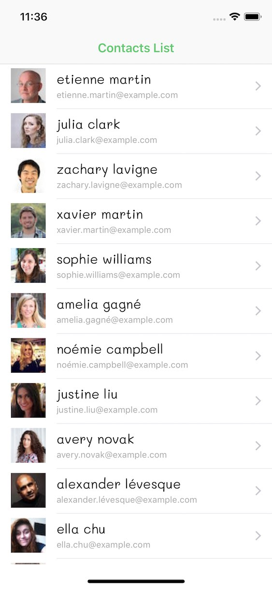
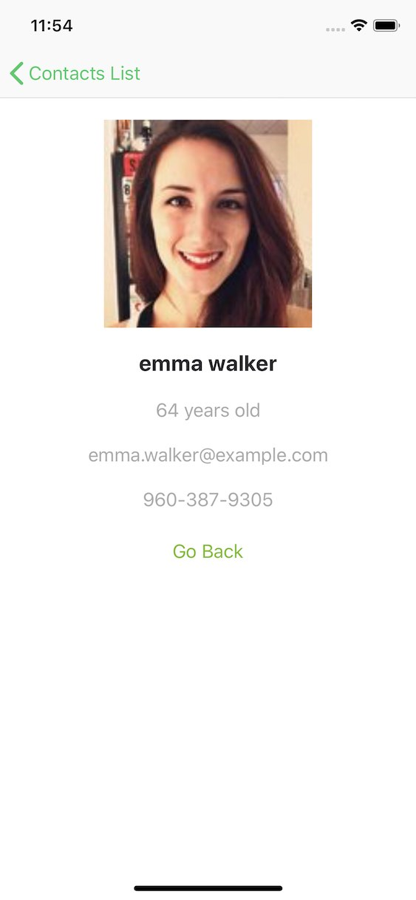

#  Contacts List (Intro to iOS Development using Swift)
This is a sample app used to introduce individuals to the basics of iOS App Development using Swift.

Use the `master` branch for the in-person workshop. Alternatevily, you should checkout the `completed` branch if you want to see the completed project.

-----
### Workshop Topics
- Tooling (XCode, CocoaPods)
- The App Life Cycle
  - `UIApplicationMain`
  - App States
  - The App Delegate
- Interface Builder & View Controllers
- TableViews Overview
- Parsing `JSON` & API calls using `URLSession` Overview
- Concurrency with `Grand Central Dispatch` Overview (_time permitting_) 

-----
### Resources
- [Random User Web API](https://randomuser.me/)
- [Apple Developer Documentation](https://developer.apple.com/documentation/)
- [Getting started with CocoaPods](https://guides.cocoapods.org/using/getting-started.html)
- [Apple XCode Help & Guides](https://help.apple.com/xcode/mac/current/)
- [Useful Shortcut for XCode 10](https://github.com/roblack/xCodeShortcuts)
- [The iOS App Lifecycle](https://developer.apple.com/library/archive/documentation/iPhone/Conceptual/iPhoneOSProgrammingGuide/TheAppLifeCycle/TheAppLifeCycle.html)
- [Ultimate Guide to JSON Parsing with Swift 4](https://benscheirman.com/2017/06/swift-json/)
- [URLSession Tutorial](https://www.raywenderlich.com/567-urlsession-tutorial-getting-started)
- Grand Central Dispatch Tutorial ([part1](https://www.raywenderlich.com/5370-grand-central-dispatch-tutorial-for-swift-4-part-1-2), [part2](https://www.raywenderlich.com/5371-grand-central-dispatch-tutorial-for-swift-4-part-2-2))
- [A Guided Tour of Swift](https://docs.swift.org/swift-book/GuidedTour/GuidedTour.html)
- Commonly used Design Patterns in iOS ([part1](https://www.raywenderlich.com/477-design-patterns-on-ios-using-swift-part-1-2), [part2](https://www.raywenderlich.com/476-design-patterns-on-ios-using-swift-part-2-2))
- [Udacity - Intro to iOS App development with Swift](https://www.udacity.com/course/intro-to-ios-app-development-with-swift--ud585)

-----
### Screenshots

-----
Marwan Alani - 2019 - [marwan@alani.ca](mailto:marwan@alani.ca), [Twitter](https://twitter.com/marwanalany), [LinkedIn](https://www.linkedin.com/in/marwanalani/), [Website](https://alani.ca)  
Written for a CSHUB workshop hosted @ York University (Toronto, Canada)
